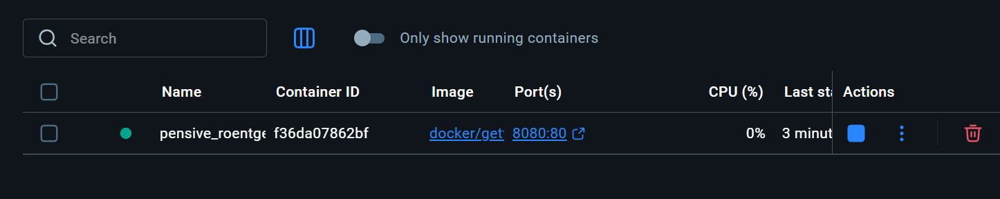
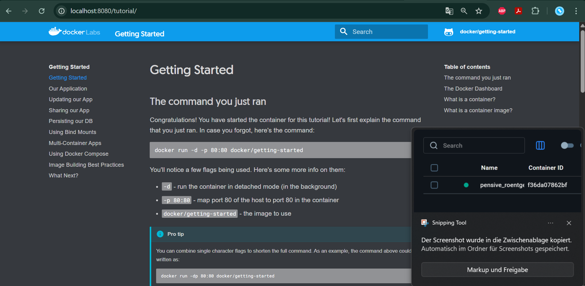
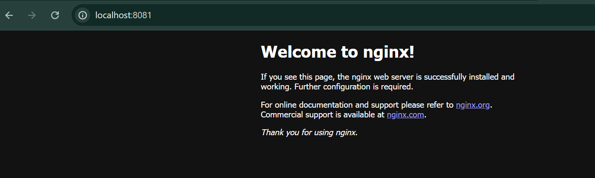
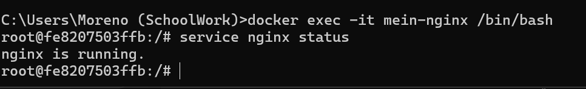
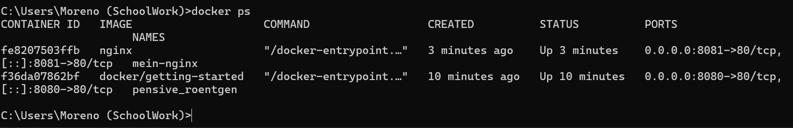
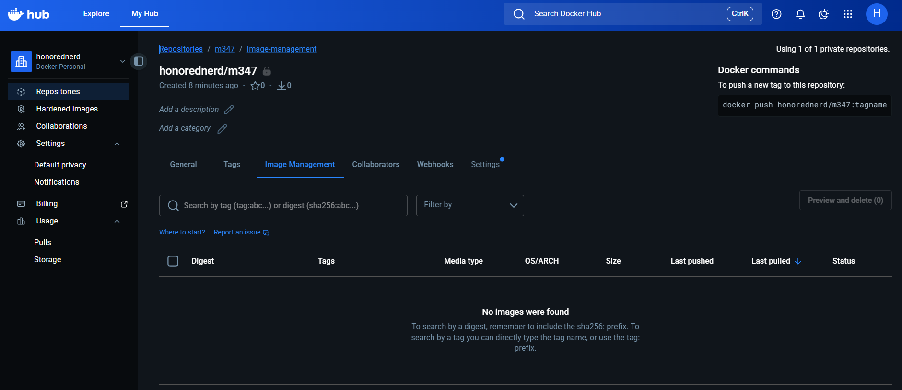
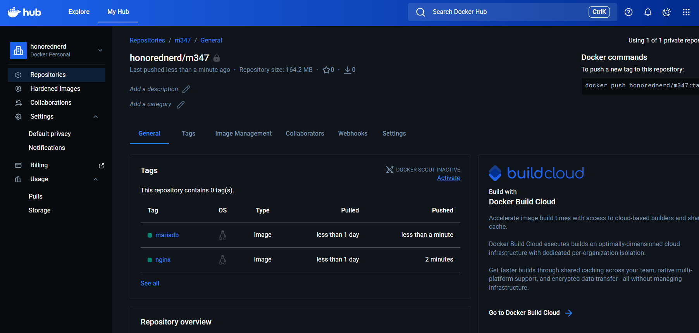

# Docker Desktop Installation

Lokal existierende Container


Localhost


# Befehle

Version prüfen `docker --version`

Ubuntu Image suchen `docker search ubuntu`  
Nginx Image suchen`docker search nginx`

### Erklärung Befehl  
docker run -d -p 80:80 docker/getting-started

- `docker run` → Erstellt und startet einen neuen Container
- `-d` → Detached Mode (Container läuft im Hintergrund)
- `-p` 80:80 → Port-Mapping
- Erster Wert = Host-Port (Computer)
- Zweiter Wert = Container-Port
- `docker/getting-started` → Name des Images

Nginx image pullen `docker pull nginx`  
Container erstellen `docker create -p 8081:80 --name mein-nginx nginx`  
Container starten `docker start mein-nginx`



Detached Terminal starten `docker run -d ubuntu`  

Das Image wird automatisch heruntergeladen, falls es lokal nicht vorhanden ist.
Der Container startet kurz, beendet sich jedoch sofort wieder.
Das liegt daran, dass Ubuntu standardmäßig keinen dauerhaften Prozess ausführt.
Da kein Dienst im Vordergrund läuft, stoppt der Container direkt wieder.
Ein Container benötigt immer einen aktiven Prozess, um weiterzulaufen.

Image terminal starten `docker run -it ubuntu` 

Das Image wird ebenfalls automatisch heruntergeladen, falls es noch nicht vorhanden ist.
Durch -it wird eine interaktive Terminal-Sitzung gestartet.
Man befindet sich direkt in der Bash des Ubuntu-Containers.
Der Container läuft so lange, bis man exit eingibt.
Nun kann man innerhalb des Containers Linux-Befehle ausführen.

Container anzeigen `docker ps`  
Shell öffnen `docker exec -it mein-nginx /bin/bash`  
Status prüfen `service nginx status`  
Shell verlassen `exit`



Alle Container anzeigen `docker ps -a`  
Nginx container stoppen `docker stop mein-nginx`  
Alle Container entfernen (powershell) `docker rm $(docker ps -aq)`



Image entfernen `docker rmi nginx`  
Image entfernen `docker rmi ubuntu`

# Docker Hub



Docker CLI einloggen `docker login`

Nginx image pullen `docker pull nginx`  
Image in eigenes Repo kopieren `docker tag nginx:latest BENUTZERNAME/reponame:nginx`  

`docker tag` erstellt keine Kopie des Images, sondern:
- weist einem bestehenden Image einen neuen Namen zu
- verbindet es mit einem Repository
- definiert einen neuen Tag  

## Was ist ein Tag?

Ein Tag ist eine Versions- oder Bezeichnungsangabe eines Docker-Images.

Beispiel:

```
nginx:latest
nginx:1.25
nginx:stable
```

- latest = Standard-Version
- Tags helfen bei Versionierung
- Ein Repository kann mehrere Tags enthalten

Image in repository hochladen `docker push BENUTZERNAME/reponame:nginx`  

Der Befehl lädt das getaggte Image in das persönliche Repository auf Docker Hub hoch  
Dabei werden nur Layer übertragen, die noch nicht existieren.

Image herunterladen `docker pull mariadb`  
Tag erstellen `docker tag mariadb:latest BENUTZERNAME/reponame:mariadb`  
Image hochladen `docker push BENUTZERNAME/reponame:mariadb`

