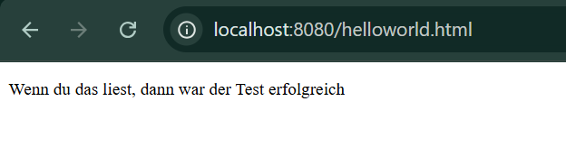
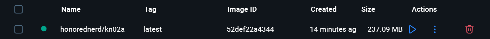
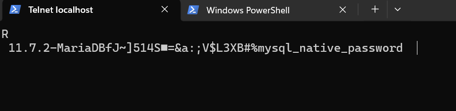
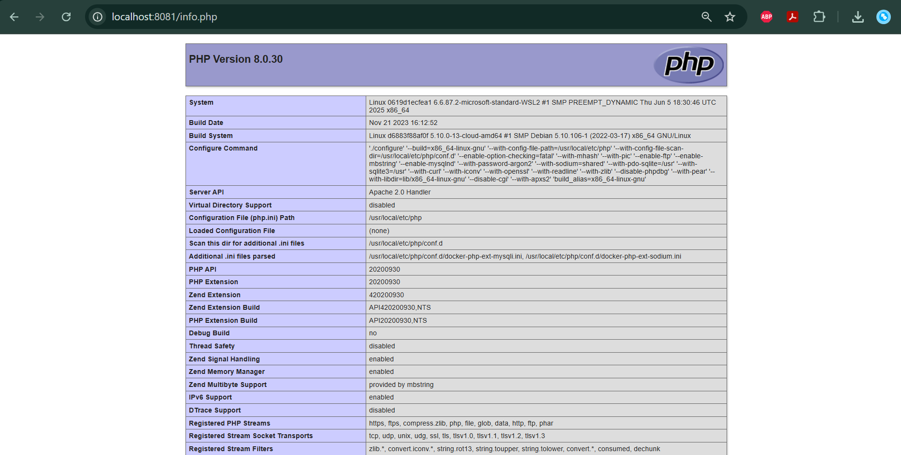
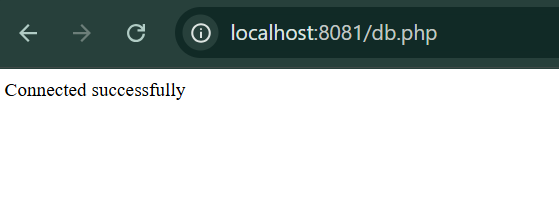

# KN02 – Dockerfile  

# Teil A – Dockerfile I (nginx)

## Dokumentation Dockerfile

```dockerfile
FROM nginx
```
Verwendet das offizielle nginx-Image als Basis.

```dockerfile
WORKDIR /usr/share/nginx/html
```
Setzt das Arbeitsverzeichnis im Container auf das nginx Webverzeichnis.

```dockerfile
COPY helloworld.html .
```
Kopiert die HTML-Datei in das Webverzeichnis.

```dockerfile
EXPOSE 80
```
Dokumentiert, dass der Container Port 80 verwendet.

---

## Finales Dockerfile

```dockerfile
FROM nginx
WORKDIR /usr/share/nginx/html
COPY helloworld.html .
EXPOSE 80
```



---

## Build Befehl

```bash
docker build -t honorednerd/kn02a .
```

---

## Run Befehl



```bash
docker run -d -p 8080:80 --name kn02a-container honorednerd/kn02a
```


---

## Push Befehl

```bash
docker push honorednerd/kn02a
```

---

# Teil B – Datenbank (kn02b-db)

## Dockerfile DB

```dockerfile
FROM mariadb
ENV MYSQL_ROOT_PASSWORD=rootpass
ENV MYSQL_DATABASE=m346
EXPOSE 3306
```

---

## Build Befehl

```bash
docker build -t honorednerd/kn02b-db .
```

---

## Run Befehl

```bash
docker run -d --name kn02b-db -p 3307:3306 honorednerd/kn02b-db
```



---

# Teil B – Web (kn02b-web)

## Dockerfile Web

```dockerfile
FROM php:8.0-apache
WORKDIR /var/www/html
COPY info.php .
COPY db.php .
RUN docker-php-ext-install mysqli
EXPOSE 80
```

---

## Build Befehl

```bash
docker build -t honorednerd/kn02b-web .
```

---

## Run Befehl

```bash
docker run -d --name kn02b-web -p 8081:80 --link kn02b-db honorednerd/kn02b-web
```


---

## info.php

```php
<?php
phpinfo();
?>
```



---

## db.php

```php
<?php
$host = "kn02b-db";
$user = "root";
$password = "rootpass";
$database = "m346";

$conn = new mysqli($host, $user, $password, $database);

if ($conn->connect_error) {
    die("Connection failed: " . $conn->connect_error);
}
echo "Connected successfully";
?>
```



---