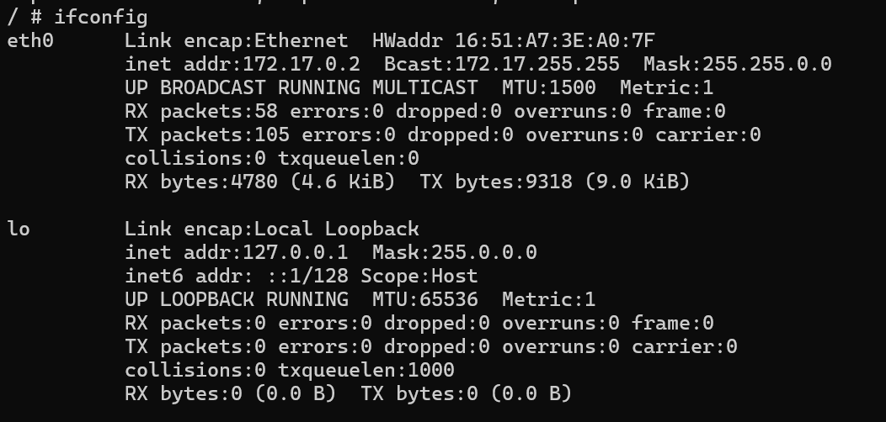
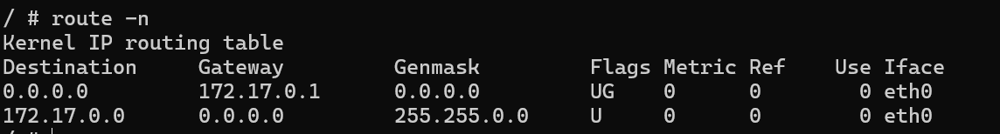
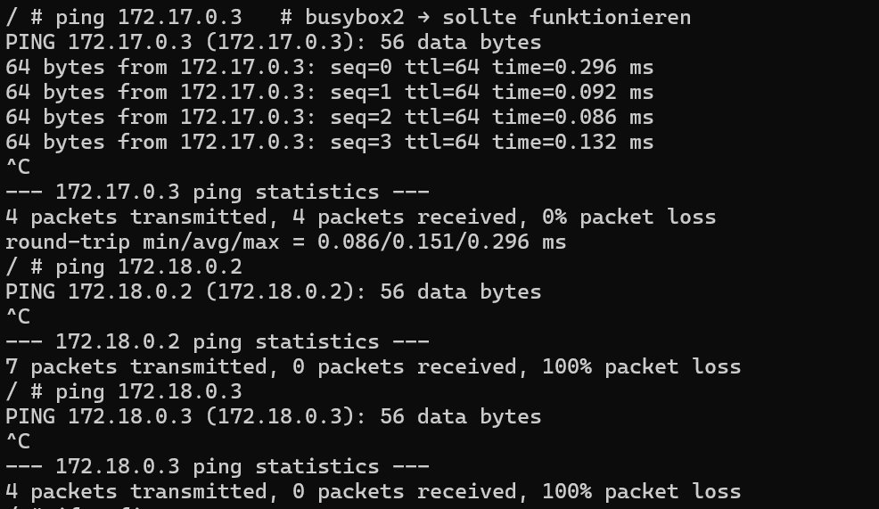
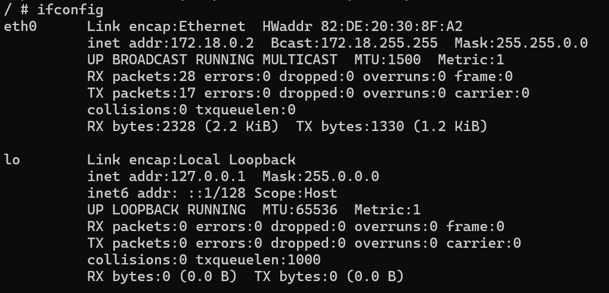
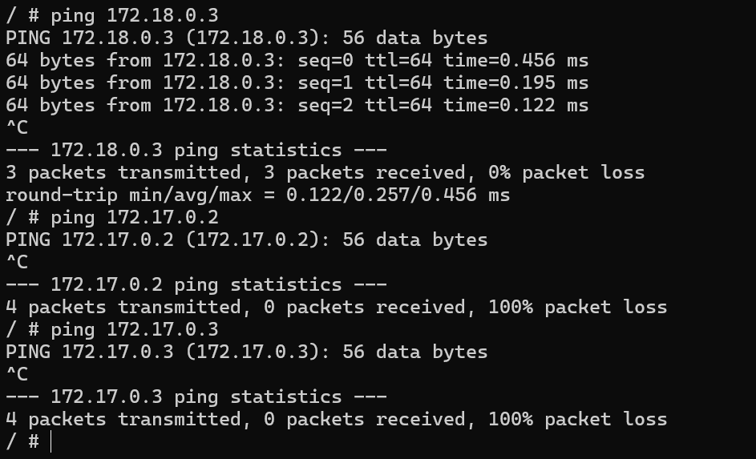
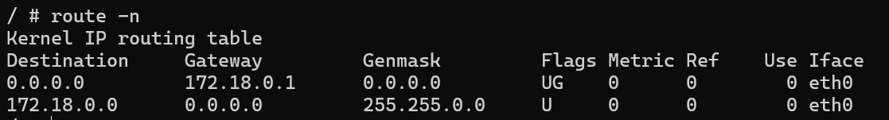

# KN03 -- Docker Netzwerke

## Übersicht der Container

  Container   Netzwerk             IP-Adresse
  ----------- -------------------- ------------
  - busybox1    default bridge       172.17.0.2
  - busybox2    default bridge       172.17.0.3
  - busybox3    tbz (user-defined)   172.18.0.2
  - busybox4    tbz (user-defined)   172.18.0.3

------------------------------------------------------------------------

# 1️⃣ Default Bridge Netzwerk (busybox1 & busybox2)

## Netzwerk-Informationen busybox1

Befehl:

``` bash
docker exec -it busybox1 sh
ifconfig
route -n
```




------------------------------------------------------------------------

## Ping-Tests von busybox1

``` bash
ping 172.17.0.3
ping 172.18.0.2
ping 172.18.0.3
```

### Erwartetes Resultat

  Ziel-IP      Erwartung
  ------------ ---------------------
  - 172.17.0.3   ✅ funktioniert
  - 172.18.0.2   ❌ nicht erreichbar
  - 172.18.0.3   ❌ nicht erreichbar




### Erklärung

-   busybox1 und busybox2 befinden sich im selben Netzwerk
    (172.17.0.0/16).
-   Kommunikation innerhalb desselben Netzwerks funktioniert.
-   Container aus anderen Netzwerken (172.18.0.0/16) sind isoliert.

------------------------------------------------------------------------

# 2️⃣ User-defined Netzwerk (tbz)

## Netzwerk-Informationen busybox3

``` bash
docker exec -it busybox3 sh
ifconfig
route -n
```



------------------------------------------------------------------------

## Ping-Tests von busybox3

``` bash
ping 172.18.0.3
ping 172.17.0.2
ping 172.17.0.3
```

### Erwartetes Resultat

  Ziel-IP      Erwartung
  ------------ ---------------------
  - 172.18.0.3   ✅ funktioniert
  - 172.17.0.2   ❌ nicht erreichbar
  - 172.17.0.3   ❌ nicht erreichbar




### Erklärung

-   busybox3 und busybox4 befinden sich im user-defined Netzwerk `tbz`
    (172.18.0.0/16).
-   Kommunikation innerhalb dieses Netzwerks funktioniert.
-   Container im default bridge Netzwerk sind isoliert.

------------------------------------------------------------------------

# 3️⃣ Wichtige Erkenntnisse

## Netzwerk-Isolation

Docker trennt Container, die sich in unterschiedlichen Netzwerken
befinden.

-   172.17.0.0/16 → default bridge
-   172.18.0.0/16 → tbz Netzwerk

Zwischen diesen Netzwerken ist keine direkte Kommunikation möglich.

------------------------------------------------------------------------

## DNS-Unterschied

Im default bridge Netzwerk funktioniert kein automatisches DNS
(Containername).

Im user-defined Netzwerk funktioniert die Namensauflösung:

``` bash
ping busybox4
```
