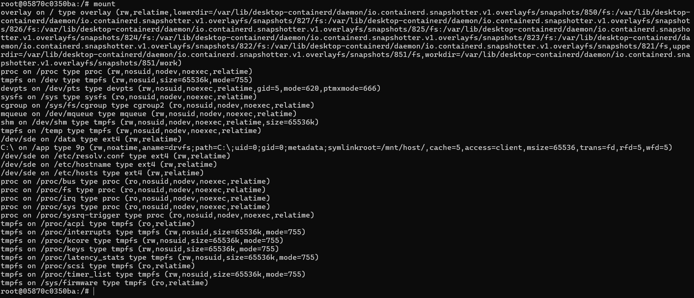
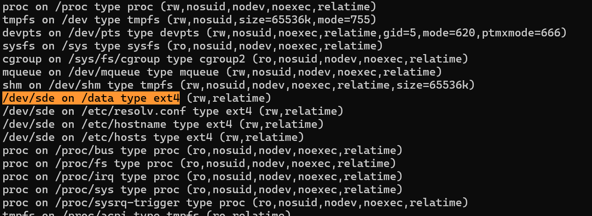

## Bind Mount Befehle

mkdir bind-test
cd bind-test

docker run -it --name bind-container -v "C:\Users\Moreno (SchoolWork)\Documents\bind-test:/app" nginx bash

cd /app
ls
bash script.sh

bash script.sh

docker rm bind-container

## Named Volumes Befehle

docker volume create mein-volume

docker run -it --name c1 -v mein-volume:/data nginx bash
echo "Hallo von Container 1" >> /data/test.txt
cat /data/test.txt

docker run -it --name c2 -v mein-volume:/data nginx bash
cat /data/test.txt
echo "Hallo von Container 2" >> /data/test.txt

cat /data/test.txt

docker rm c1 c2
docker volume rm mein-volume

