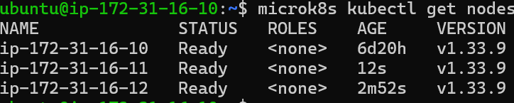
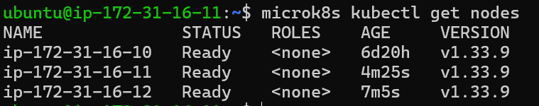
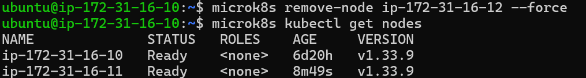
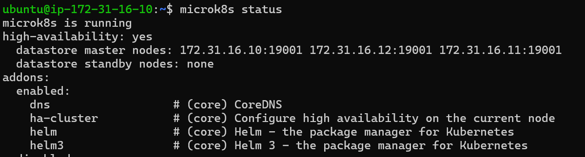
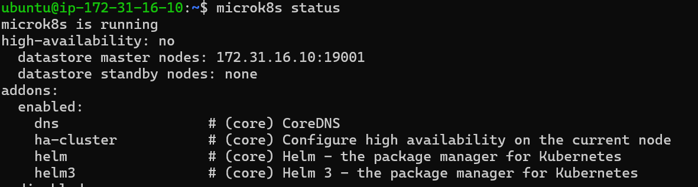
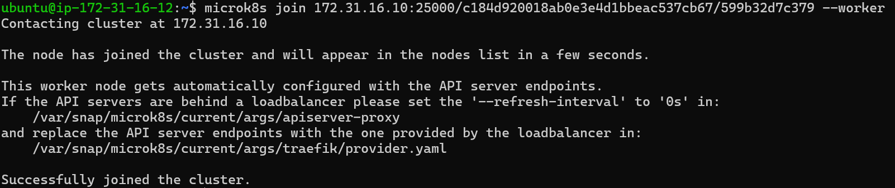
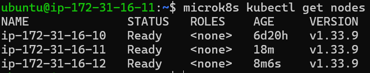

## Teil B: Cluster Verständnis

Der Befehl `microk8s status` zeigt den aktuellen Zustand des MicroK8s Clusters.

- `microk8s is running` bedeutet, dass der Kubernetes Dienst aktiv ist.
- `high-availability: yes` bedeutet, dass mehrere Nodes vorhanden sind und der Cluster Ausfälle einzelner Nodes tolerieren kann.
- Die `datastore nodes` zeigen, welche Nodes den internen Kubernetes Datenspeicher verwalten.

## Node Übersicht

Hier sind die Screenshots der einzelnen Schritte, wie im Auftrag verlangt:

### 1. Alle Nodes vom Master aus

### 2. Nodes von Worker 1 aus

### 3. Node Worker 2 entfernt

### 4. Status vor dem Hinzufügen als Worker

### 5. Status nach dem Hinzufügen als Worker

### 6. Worker 2 dem Cluster hinzugefügt (--worker)

### 7. Node Übersicht nach Abschluss auf Worker 1

## Unterschied `microk8s` vs `microk8s kubectl`

- `microk8s` ist das Verwaltungswerkzeug für die lokale MicroK8s Installation. Mit ihm kann man den Cluster starten, stoppen und Nodes verwalten.
- `microk8s kubectl` ist das Kubernetes Kommandozeilenwerkzeug, das in MicroK8s eingebettet ist. Damit kann man Ressourcen im Cluster wie Nodes, Pods oder Deployments verwalten.

## Unterschied vor/nach --worker

- Vor dem Hinzufügen als Worker kann ein Node den Datastore und Control-Plane Funktionen übernehmen.
- Nach dem Hinzufügen als Worker führt der Node nur Container und Pods aus, übernimmt aber keine Cluster-Verwaltung mehr.