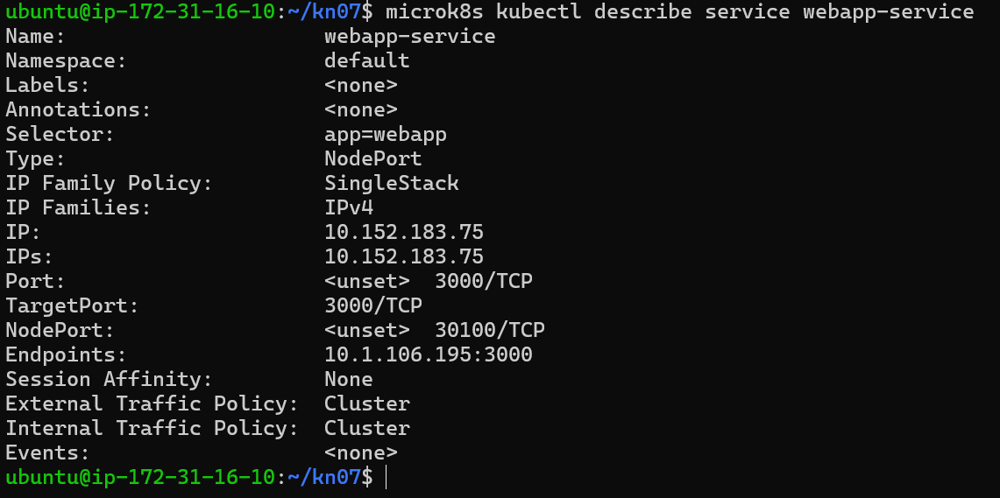
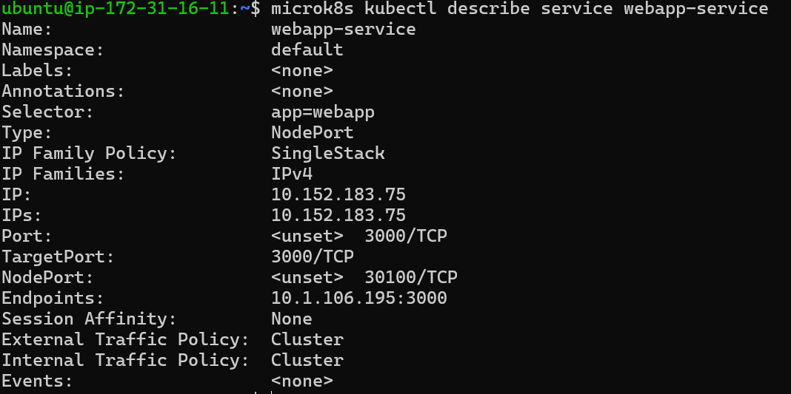
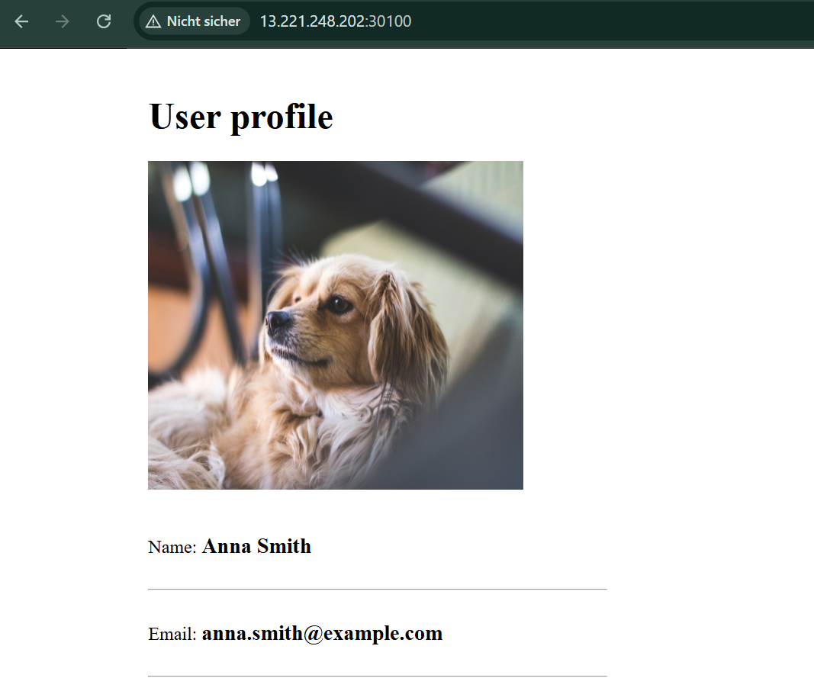
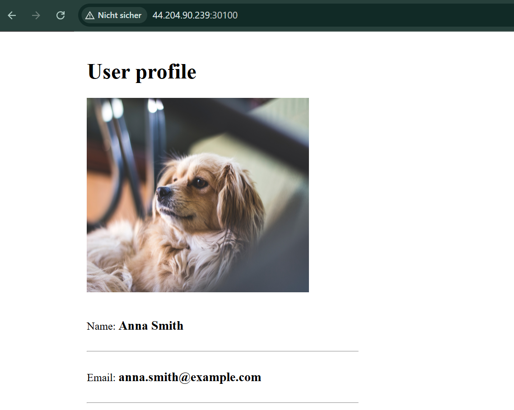
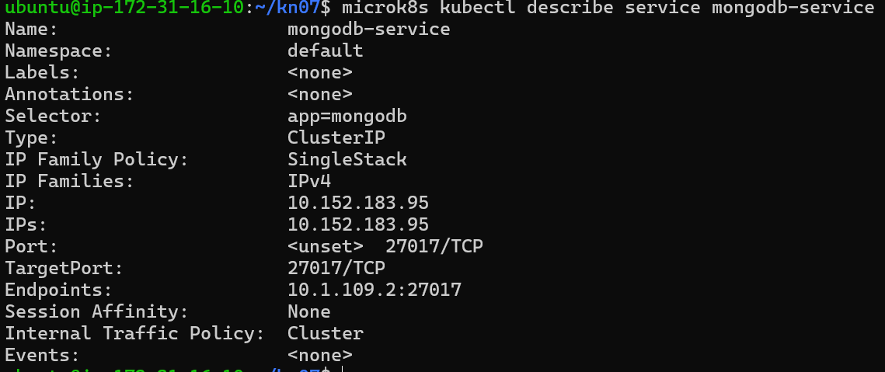
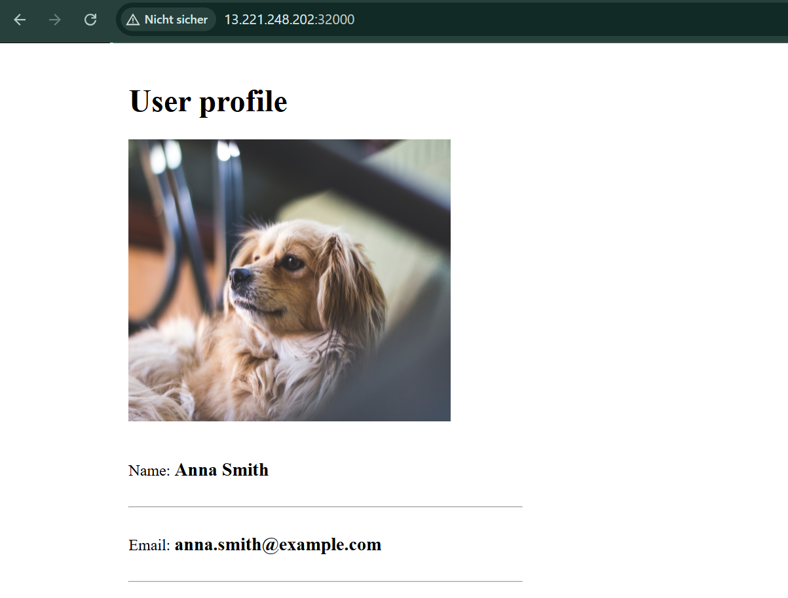
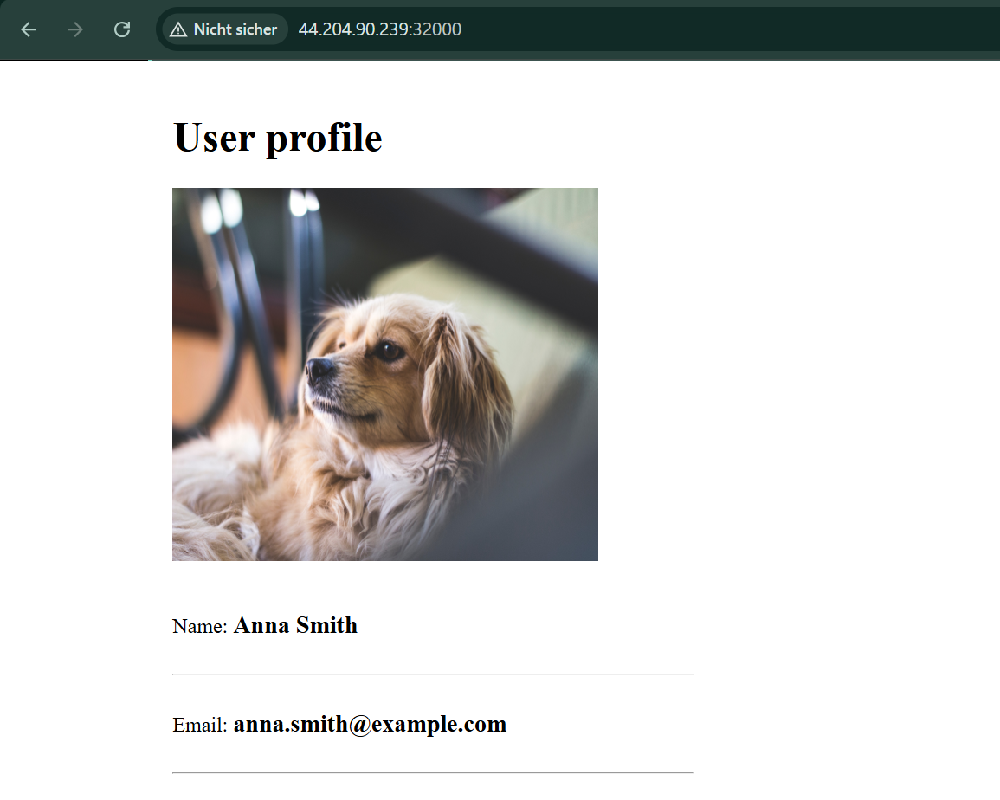

# Kompetenznachweis KN07: Kubernetes II

## A) Begriffe und Konzepte

### Unterschied zwischen Pods und Replicas
Ein **Pod** ist die kleinste ausführbare Einheit in Kubernetes. Er beherbergt einen oder mehrere Container (z. B. eine Web-App), die sich ein Netzwerk und Speicher teilen. Ein Pod ist vergänglich; wenn er abstürzt, wird er nicht automatisch ersetzt.

**Replicas** beschreiben die Anzahl identischer Kopien eines Pods, die gleichzeitig laufen sollen. Ein ReplicaSet sorgt dafür, dass dieser "Desired State" jederzeit aufrechterhalten wird. Fällt ein Pod aus, startet Kubernetes sofort eine neue Replica, um die Verfügbarkeit zu sichern.

### Unterschied zwischen Service und Deployment
Ein **Deployment** verwaltet die Pods. Es definiert, welches Image genutzt wird, wie viele Replicas existieren sollen und steuert Updates. Es ist sozusagen der "Manager" der Software-Instanzen.

Ein **Service** stellt eine stabile Netzwerk-Schnittstelle bereit. Da Pods kommen und gehen und ihre internen IP-Adressen ständig ändern, bietet ein Service einen festen DNS-Namen oder eine Cluster-IP, über die andere Komponenten (oder externe Nutzer) zuverlässig auf die Pods zugreifen können.

### Welches Problem löst Ingress?
Ingress löst das Problem der effizienten externen Erreichbarkeit bei vielen verschiedenen Diensten. Ohne Ingress müsste man für jeden Dienst einen eigenen NodePort oder LoadBalancer verwenden. Ingress fungiert als intelligenter Einstiegspunkt (Reverse Proxy), der Traffic basierend auf Hostnamen (z. B. `app.beispiel.ch`) oder Pfaden zentral an die richtigen internen Services weiterleitet.

### Für was ist ein StatefulSet? (Beispiel ohne Datenbank)
Ein **StatefulSet** wird für Anwendungen verwendet, die eine **stabile Identität** und einen persistenten Zustand benötigen. Im Gegensatz zu Deployments haben Pods hier feste Namen (z. B. `web-0`, `web-1`) und behalten ihre Datenzuordnung auch nach einem Neustart bei.

* **Beispiel (keine Datenbank):** Ein **Message Broker wie RabbitMQ** im Cluster-Verbund. Die Instanzen müssen sich unter festen Namen finden können, um Nachrichten korrekt zu synchronisieren.

---

## B) Demo Projekt

### Warum wurde ein Teil der Services nicht wie im Tutorial umgesetzt?
Im Demo-Projekt wurde die MongoDB als einfaches **Deployment** umgesetzt. In der Theorie (Teil A) haben wir gelernt, dass für Datenbanken ein **StatefulSet** empfohlen wird, um Datenpersistenz und stabile Identitäten zu garantieren. Für dieses Demo wurde die einfachere Variante gewählt, um den Fokus auf die Vernetzung der Web-App zu legen.

### Warum ist die MongoURL in der ConfigMap korrekt?
Die URL (z. B. `mongo-service`) ist korrekt, weil Kubernetes einen **internen DNS-Dienst** besitzt. Services sind innerhalb des Clusters über ihren Namen erreichbar. Die Web-App muss also nicht die IP der Datenbank kennen, sondern fragt einfach den DNS-Namen an, den Kubernetes automatisch in die richtige Cluster-IP auflöst.

### Screenshots: webapp-service Installation
Der Befehl `microk8s kubectl describe service webapp-service` wurde auf verschiedenen Nodes ausgeführt, um das korrekte Routing des NodePort-Services zu validieren.

* 
* 

### Unterschiede zum zweiten Service (mongo-service)
Der `webapp-service` ist vom Typ **NodePort** (extern über Port 30100 erreichbar), während der `mongo-service` vom Typ **ClusterIP** ist. ClusterIP bedeutet, dass die Datenbank nur innerhalb des Clusters für andere Pods (wie die Web-App) erreichbar ist, was die Sicherheit erhöht.

### Webseite aufrufen
Die Webseite wurde über die öffentliche IP der AWS-Nodes und den Port **30100** aufgerufen. Hierzu musste die AWS Security Group entsprechend angepasst werden, um den Traffic durchzulassen.

* 
* 

### Verbindung mit MongoDB Compass
Der Zugriff via MongoDB Compass von einem externen Computer schlägt fehl, da der Service als `ClusterIP` definiert ist. ClusterIP-Services erlauben keine Verbindungen von außerhalb des Kubernetes-Netzwerks. Zur Lösung müsste der Typ auf `NodePort` geändert oder ein Port-Forwarding eingerichtet werden.

### Task 7: Portänderung auf 32000 und 3 Replicas
Um die Hochverfügbarkeit und Port-Flexibilität zu testen, wurden folgende Änderungen durchgeführt:
1.  **Deployment:** Die Anzahl der `replicas` wurde in der `webapp.yaml` von 1 auf **3** erhöht.
2.  **Service:** Der `nodePort` wurde in der Service-Definition von 30100 auf **32000** geändert.
3.  **Fehlerbehebung:** Während der Umsetzung wurde die Umgebungsvariable für das Datenbank-Passwort in der `webapp.yaml` auf `PASSWORD` korrigiert, um eine erfolgreiche Authentifizierung an der MongoDB zu ermöglichen.
4.  Anwenden der Änderungen mittels `microk8s kubectl apply -f webapp.yaml`.

**Überprüfung:**
Im `describe service` sieht man nun drei **Endpoints** (die IPs der drei laufenden Web-Pods), was die erfolgreiche Skalierung beweist. Die Webseite ist nun über Port 32000 erreichbar.

* 
* 
* 